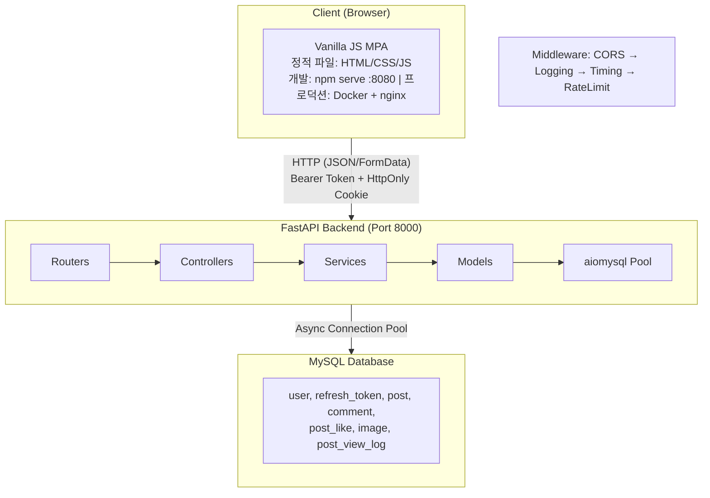
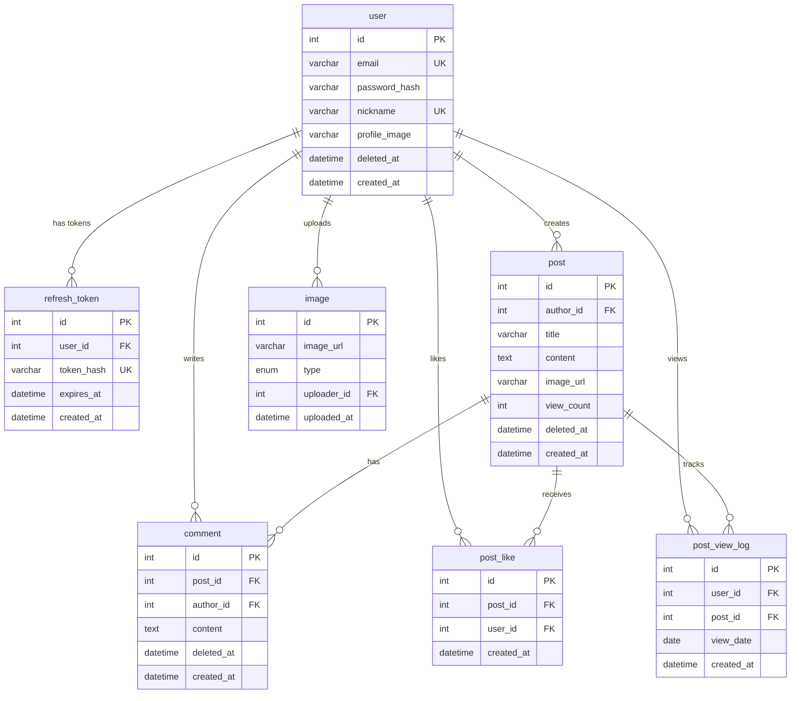
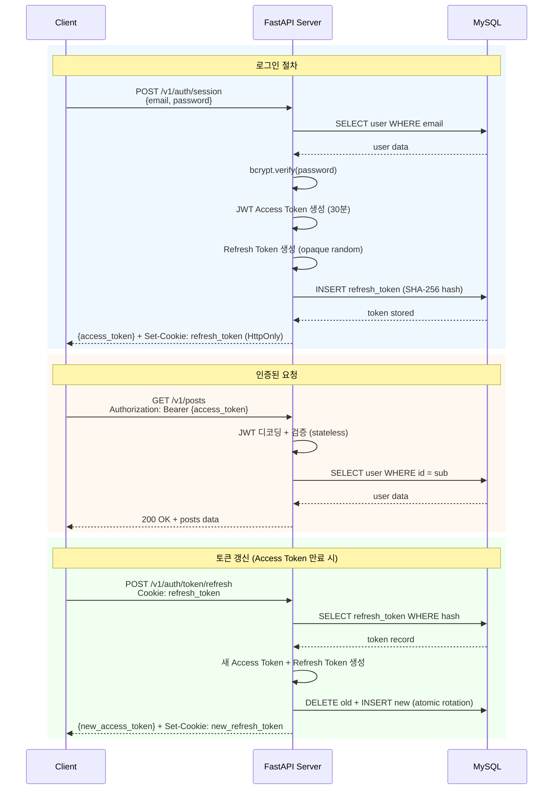

# 2-cho-community-be
AWS AI School 2기 3주차 과제: 커뮤니티 백엔드 서버

## 요약 (Summary)

커뮤니티 포럼 "아무 말 대잔치"를 구축합니다. FastAPI를 기반으로 하는 비동기 백엔드와 Vanilla JavaScript 프론트엔드로 구성된 모노레포 구조이며, JWT 기반 인증(Access Token + Refresh Token)과 MySQL 데이터베이스를 사용합니다. 게시글 CRUD, 댓글, 좋아요, 회원 관리 기능을 제공합니다.

## 배경 (Background)

AWS AI School 2기의 개인 프로젝트로 커뮤니티 서비스를 개발해야 합니다. 수강생들이 자유롭게 소통할 수 있는 공간이 필요하며, 실무에서 자주 사용되는 기술 스택(FastAPI, MySQL, Vanilla JS)을 학습하고 적용하는 것이 목표입니다.

기존에 별도의 커뮤니티 플랫폼이 없어 수강생 간 교류가 제한적이었습니다. 이 서비스를 통해 학습 경험을 공유하고, 질문/답변을 주고받으며, 프로젝트 협업의 기회를 마련하고자 합니다.

## 목표 (Goals)

- 회원가입, 로그인, 로그아웃, 회원 탈퇴 기능을 제공한다.
- 게시글 작성, 조회, 수정, 삭제(CRUD) 기능을 제공한다.
- 댓글 작성, 수정, 삭제 기능을 제공한다.
- 게시글 좋아요/좋아요 취소 기능을 제공한다.
- 프로필 이미지 및 닉네임 수정 기능을 제공한다.
- 무한 스크롤 기반의 게시글 목록을 제공한다.
- 모바일/데스크탑 반응형 UI를 제공한다.

## 목표가 아닌 것 (Non-Goals)

- 실시간 알림 기능 (WebSocket)
- 게시글 검색 기능
- 대댓글(nested comments) 기능
- 소셜 로그인 (OAuth)
- 이메일 인증 및 비밀번호 찾기
- 관리자 대시보드
- 게시글 카테고리 또는 태그 기능

## 계획 (Plan)

### 1. 시스템 아키텍처



### 2. 데이터베이스 설계

#### ERD



#### 주요 설계 결정

- **Soft Delete**: `user`, `post`, `comment` 테이블에 `deleted_at` 컬럼 사용. 물리적 삭제 대신 논리적 삭제로 데이터 보존.
- **JWT 기반 인증**: Access Token(30분, HS256) + Refresh Token(7일, opaque random). Access Token은 프론트엔드 in-memory 저장, Refresh Token은 HttpOnly 쿠키로 전달하고 SHA-256 해시로 DB 저장. JWT payload에는 `sub`(user_id)만 포함하여 PII 노출 방지. 토큰 회전(rotation)으로 Refresh Token 탈취 시 자동 무효화.
- **인덱스 전략**:
  - `idx_refresh_token_hash`: Refresh Token 해시 조회
  - `idx_post_created_deleted`: 최신순 게시글 목록 조회
  - `idx_comment_post_deleted`: 게시글별 댓글 목록 조회

### 3. API 설계

#### 인증 API (`/v1/auth`)

| Method | Endpoint | 설명 | 인증 |
| ------ | -------- | ---- | ---- |
| POST | `/v1/auth/session` | 로그인 (Access Token + Refresh Token 발급) | X |
| DELETE | `/v1/auth/session` | 로그아웃 (Refresh Token 무효화) | O |
| POST | `/v1/auth/token/refresh` | 토큰 갱신 (Refresh Token → 새 Access Token) | X (쿠키) |
| GET | `/v1/auth/me` | 현재 사용자 정보 | O |

#### 사용자 API (`/v1/users`)

| Method | Endpoint | 설명 | 인증 |
| ------ | -------- | ---- | ---- |
| POST | `/v1/users` | 회원가입 | X |
| GET | `/v1/users/{user_id}` | 사용자 프로필 조회 | X |
| PATCH | `/v1/users/me` | 프로필 수정 (본인) | O |
| DELETE | `/v1/users/me` | 회원 탈퇴 (본인) | O |
| PUT | `/v1/users/me/password` | 비밀번호 변경 | O |
| POST | `/v1/users/profile/image` | 프로필 이미지 업로드 | O |

#### 게시글 API (`/v1/posts`)

| Method | Endpoint | 설명 | 인증 |
| ------ | -------- | ---- | ---- |
| GET | `/v1/posts` | 게시글 목록 (페이지네이션) | X |
| POST | `/v1/posts` | 게시글 작성 | O |
| GET | `/v1/posts/{post_id}` | 게시글 상세 조회 | X |
| PATCH | `/v1/posts/{post_id}` | 게시글 수정 | O (작성자) |
| DELETE | `/v1/posts/{post_id}` | 게시글 삭제 | O (작성자) |
| POST | `/v1/posts/{post_id}/likes` | 좋아요 | O |
| DELETE | `/v1/posts/{post_id}/likes` | 좋아요 취소 | O |
| POST | `/v1/posts/{post_id}/comments` | 댓글 작성 | O |
| PUT | `/v1/posts/{post_id}/comments/{comment_id}` | 댓글 수정 | O (작성자) |
| POST | `/v1/posts/{post_id}/comments` | 댓글 작성 | O |
| PUT | `/v1/posts/{post_id}/comments/{comment_id}` | 댓글 수정 | O (작성자) |
| DELETE | `/v1/posts/{post_id}/comments/{comment_id}` | 댓글 삭제 | O (작성자) |
| POST | `/v1/posts/image` | 게시글 이미지 업로드 | O |

#### 응답 형식

```json
{
  "code": 200,
  "message": "성공",
  "data": { },
  "errors": null,
  "timestamp": "2024-01-01T00:00:00Z"
}
```

#### 에러 코드

| HTTP Status | 설명 |
| ----------- | ---- |
| 400 | 잘못된 요청 (유효성 검사 실패) |
| 401 | 인증 필요 (토큰 만료/미로그인) |
| 403 | 권한 없음 (타인의 게시글 수정 시도 등) |
| 404 | 리소스 없음 |
| 409 | 충돌 (이메일/닉네임 중복) |
| 500 | 서버 오류 |

### 4. 인증 흐름



### 5. 프론트엔드 아키텍처

#### 디렉토리 구조

```text
2-cho-community-fe/
├── html/                    # 8개 정적 HTML 페이지
│   ├── post_list.html       # 메인 피드
│   ├── post_detail.html     # 게시글 상세
│   ├── post_write.html      # 게시글 작성
│   ├── post_edit.html       # 게시글 수정
│   ├── user_login.html      # 로그인
│   ├── user_signup.html     # 회원가입
│   ├── user_password.html   # 비밀번호 변경
│   └── user_edit.html       # 프로필 수정
│
├── js/
│   ├── app/                 # 페이지별 진입점
│   ├── controllers/         # 비즈니스 로직
│   ├── models/              # API 통신 계층
│   ├── views/               # DOM 렌더링
│   ├── services/            # ApiService (HTTP 클라이언트)
│   ├── utils/               # Logger, Validators, Formatters
│   ├── config.js            # API_BASE_URL
│   └── constants.js         # 엔드포인트, 메시지, 라우트
│
└── css/
    ├── style.css            # 마스터 import
    ├── base.css             # 리셋, 타이포그래피
    ├── layout.css           # 헤더, 컨테이너
    ├── modules/             # 재사용 컴포넌트 (버튼, 폼, 카드, 모달, 토스트)
    └── pages/               # 페이지별 스타일
```

#### MVC 패턴

- **Model**: API 호출 담당. `AuthModel`, `PostModel`, `UserModel`, `CommentModel`
- **View**: DOM 렌더링. 정적 메서드로 HTML 생성 및 이벤트 바인딩
- **Controller**: 비즈니스 로직. Model과 View 조정, 상태 관리

#### 주요 패턴

- **정적 메서드**: 모든 클래스가 static 메서드만 사용
- **IntersectionObserver**: 무한 스크롤 구현
- **Custom Event**: `auth:session-expired` 이벤트로 401 처리 (silent refresh 실패 시 발생)
- **XSS 방지**: `escapeHtml()` 유틸리티로 사용자 입력 이스케이프

### 6. 보안 고려사항

| 항목 | 구현 방식 |
| ---- | --------- |
| 비밀번호 해싱 | bcrypt (cost factor 기본값) |
| JWT 인증 | Access Token(30분, in-memory) + Refresh Token(7일, HttpOnly Cookie, SHA-256 해시 DB 저장) |
| CORS | 허용 출처 명시적 설정 (localhost:8080) |
| SQL Injection | Parameterized queries (aiomysql) |
| XSS | 프론트엔드에서 escapeHtml() 적용 |
| Timing Attack | 로그인 시 존재하지 않는 사용자도 bcrypt 검증 수행 |

### 7. 비밀번호 정책

- 길이: 8-20자
- 필수 포함: 대문자, 소문자, 숫자, 특수문자

## 이외 고려 사항들 (Other Considerations)

- **JWT 인증**: Access Token(HS256, 30분) + Refresh Token(opaque random, 7일) 이중 토큰 전략 사용. Access Token은 프론트엔드 in-memory(JS 변수)에 저장하여 XSS 노출 최소화, Refresh Token은 HttpOnly 쿠키로 전달하고 SHA-256 해시로 DB에 저장. 토큰 회전(rotation)을 통해 Refresh Token 탈취 시 자동 무효화. CSRF 미들웨어는 제거됨 (Bearer 토큰이 CSRF 방어 역할).
- **ORM vs Raw SQL**: SQLAlchemy 등 ORM 사용을 고려했으나, 학습 목적으로 raw SQL을 직접 작성하여 쿼리 최적화 경험을 쌓기로 결정.
- **Vanilla JS**: React, Vue 등 프레임워크 대신 Vanilla JS를 선택. 프레임워크 학습 비용 없이 JavaScript 기본기를 다지는 것이 목표.
- **이미지 저장소**: Docker 환경에서는 `/app/uploads` 볼륨에 저장하고 nginx가 직접 서빙. 로컬 개발 시에도 로컬 파일시스템 사용.
- **Soft Delete**: 물리적 삭제 대신 `deleted_at` 컬럼 사용. 데이터 복구 가능성 확보 및 FK 무결성 유지.

## 마일스톤 (Milestones)

| 단계 | 기간 | 내용 |
| ---- | ---- | ---- |
| 1단계 | 1주차 | DB 스키마 설계, 백엔드 프로젝트 셋업, 인증 API 구현 |
| 2단계 | 2주차 | 게시글/댓글/좋아요 API 구현, 이미지 업로드 |
| 3단계 | 3주차 | 프론트엔드 구현 (HTML/CSS/JS), API 연동 |
| 4단계 | 4주차 | E2E 테스트 작성, QA, 버그 수정 |
| 5단계 | 5주차 | 문서화, 코드 리뷰, 최종 배포 |

## 최근 변경사항 (Recent Changes)

## changelog

- 2026-02-26: AWS Lambda 배포 호환성 + OpenAPI 스펙 생성
  - Lambda 환경 감지: `AWS_LAMBDA_FUNCTION_NAME` 환경변수로 자동 전환
  - `database/connection.py`: Lambda 시 DB 풀 크기 축소 (5-50 → 1-5, RDS Proxy 전제)
  - `main.py`: Lambda 시 정적 파일 마운트 생략 (S3 사용), 토큰 정리 백그라운드 작업 생략
  - `openapi.json` 생성: FastAPI `app.openapi()` → OpenAPI 3.0.3 변환 (API Gateway 호환)
    - `anyOf` null 패턴 → `nullable: true` 변환
    - 스키마명 alphanumeric 변환 (API Gateway 제약)

- 2026-02-25: GitHub Actions CI/CD 확장 — ECR → EC2 자동 배포
  - 백엔드 워크플로우: database 이미지 빌드/푸시 추가, `deploy-ec2` job으로 SSH 배포
  - `appleboy/ssh-action@v1`으로 EC2 접속, ECR pull → `docker compose up -d`
  - paths 필터 확장: `database/schema.sql` → `database/**` (Dockerfile 변경도 트리거)

- 2026-02-25: JWT payload 최소화 + 코드 리뷰 수정
  - JWT payload에서 PII 제거: `email`, `nickname`, `role` 클레임 삭제, `sub`(user_id)만 유지
  - 파일명 변경: `session_models.py` → `token_models.py`
  - 변수명 개선: `_ALGORITHM` → `_JWT_ALGORITHM`, `DUMMY_HASH` → `_TIMING_ATTACK_DUMMY_HASH` 등
  - 주석 정리: 중복 주석 제거, 영어 → 한국어, 잘못된 주석 수정

- 2026-02-25: JWT 인증으로 전환 (세션 기반 → JWT)
  - 인증 방식 변경: 서버 사이드 세션 → JWT (Access Token 30분 + Refresh Token 7일)
    - Access Token: HS256 JWT, 프론트엔드 in-memory 저장 (XSS 최소화)
    - Refresh Token: opaque random string, HttpOnly 쿠키, SHA-256 해시로 DB 저장
    - 토큰 회전(rotation): 갱신 시 기존 Refresh Token 삭제 + 새 토큰 발급 (원자적 트랜잭션)
  - DB 스키마 변경: `user_session` 테이블 → `refresh_token` 테이블
  - 새 엔드포인트: `POST /v1/auth/token/refresh` (토큰 갱신)
  - CSRF 미들웨어 제거: Bearer 토큰이 CSRF 방어 역할 수행
  - SessionMiddleware 제거: JWT는 stateless, 서버 사이드 세션 불필요
  - 프론트엔드 변경:
    - `ApiService.js`: Bearer 토큰 관리, silent refresh, thundering herd 보호
    - `AuthModel.js`: 페이지 새로고침 시 HttpOnly 쿠키로 silent refresh
  - 의존성 변경: `itsdangerous` → `PyJWT`
  - 만료 토큰 자동 정리: `_periodic_token_cleanup()` 백그라운드 작업 (1시간 간격, `main.py` lifespan)
  - 테스트 업데이트: 59개 전체 통과

- 2026-02-25: 보안 강화, CI/CD 개선, 코드 품질 향상
  - `ProxyHeadersMiddleware` 보안 수정
    - `trusted_hosts="*"` → `settings.TRUSTED_PROXIES` 또는 기본값 `["127.0.0.1", "::1"]`
    - IP 스푸핑 방지를 위해 신뢰할 프록시 IP만 명시적으로 허용
    - `main.py:88-91`에서 설정 기반 동적 구성
  - GitHub Actions CI 워크플로우 개선 (`.github/workflows/python-app.yml`)
    - `test` job 추가: MySQL 서비스 컨테이너, ruff 린팅, mypy 타입 체크, pytest 실행
    - Python 버전 수정: 3.10 → 3.11 (`pyproject.toml` 요구사항과 일치)
    - 테스트 게이팅: `needs: test`로 테스트 통과 후에만 배포
    - PR에서는 테스트만 실행: `if: github.event_name == 'push'` 조건 추가
    - Docker 빌드 시 `--platform linux/amd64` 명시
    - `.py`, `pyproject.toml`, `Dockerfile`, `schema.sql` 등 코드 변경 시에만 CI/CD 실행
    - README, 문서 변경 시 불필요한 Docker 빌드/ECR 푸시 방지
  - 코드 품질 개선 (ruff/mypy CI 통과)
    - 13개 미사용 import 제거 (`seed_data.py`, `user_service.py`, `test_*.py`)
    - `__init__.py` 추가: `utils/`, `database/`, `tests/` (mypy 패키지 인식)
    - `pyproject.toml`에 `[tool.mypy]` 설정 추가 (pydantic 플러그인, ignore_missing_imports)
    - 타입 에러 수정: `assert` 문으로 None 체크, `# type: ignore` 주석 추가

- 2026-02-24: Docker + EC2 배포로 전환
  - 배포 아키텍처 변경: CloudFront + S3 + ELB → Docker Compose + 단일 EC2
    - 이전: CloudFront (CDN) → S3 (정적 파일) + ELB → EC2 (API)
    - 현재: EC2 (nginx + uvicorn + MySQL, 단일 인스턴스)
  - Docker Compose 프로덕션 설정 (`docker-compose.prod.yml`)
    - `frontend`: nginx:alpine 기반, 정적 파일 서빙 + 리버스 프록시
    - `backend`: FastAPI + uvicorn, `/app/uploads` 볼륨 마운트
    - `database`: MySQL 9.6, 데이터 영속성을 위한 볼륨 마운트
    - 컨테이너 간 통신: Docker 내부 네트워크 (`my-community-network`)
  - nginx 리버스 프록시 설정 (`2-cho-community-fe/nginx.conf`)
    - HTTPS 강제 리다이렉트 (80 → 443)
    - Let's Encrypt SSL 인증서 (`/etc/letsencrypt/live/my-community.shop/`)
    - Clean URL 지원 (`/main` → `post_list.html`, `/login` → `user_login.html`)
    - API 프록시: `/v1/*`, `/health` → `backend:8000`
  - 프론트엔드 Dockerfile (`2-cho-community-fe/Dockerfile`)
    - nginx:alpine 기반 경량 이미지
    - 헬스체크 포함 (`wget --spider http://localhost:80/`)
  - 장점: 단일 EC2로 비용 절감, Docker로 환경 일관성 보장, 배포 단순화 (`docker compose up -d`)

- 2026-02-19: CloudFront + S3 배포 전환
  - 배포 아키텍처 변경: Single-Origin Nginx (EC2) → **CloudFront + S3 + ELB**
    - 정적 파일: S3 버킷 + CloudFront CDN 서빙
    - API 요청: CloudFront `/v1/*` → ELB → EC2:8000
    - WAF WebACL 연결 (IP Reputation, Common Rule Set, Known Bad Inputs)
  - WAF `SizeRestrictions_BODY` COUNT 모드 오버라이드 (이미지 업로드 8KB 제한 해제)
  - 이미지 저장/서빙을 S3 + CloudFront URL 방식으로 전환 (`utils/s3_utils.py`)
  - `CLOUDFRONT_DOMAIN` 환경변수 추가 (`.env`에서 설정)
  - ELB Health Check 통과를 위해 uvicorn `--host 0.0.0.0` 바인딩으로 변경

- 2026-02-12: 프론트엔드 개발 환경 변경, Single-Origin Nginx 배포 설정
  - 쿠키 설정 변경
    - `main.py`: `same_site="none"` → `same_site="lax"` (보안 강화)
    - `csrf_protection.py`: `samesite="none"` → `samesite="strict"` (CSRF 최대 보호)
    - `HTTPS_ONLY`를 환경변수 기반으로 변경 (유연성 향상)
  - 프론트엔드 API 설정
    - `config.js`: `API_BASE_URL = ""` (same-origin, nginx가 프록시)
  - 배포 방식 단순화
    - Cross-domain (S3 + EC2) → Single-origin (nginx reverse proxy)
    - 쿠키 문제 해결, 보안 강화, 설정 간소화
  - 프론트엔드가 npm serve로 마이그레이션 완료
    - 로컬 개발: FastAPI/uvicorn → `npm serve` (Port 8080)
    - 프론트엔드는 순수 정적 파일(HTML/CSS/JS)로 Python 의존성 없음
    - 프로덕션: nginx로 정적 파일 서빙

- 2026-02-09: 코드 리뷰 기반 주요 이슈 수정
  - 보안 관련 수정
    - `main.py`: CSRF 미들웨어 순서 수정 (DoS 우회 방지)
      - 변경 전: `LoggingMiddleware → RateLimitMiddleware → CSRFProtectionMiddleware → SessionMiddleware`
      - 변경 후: `LoggingMiddleware → SessionMiddleware → CSRFProtectionMiddleware → RateLimitMiddleware`
      - 공격자가 잘못된 CSRF 토큰으로 Rate Limit 우회하는 취약점 제거
    - `middleware/csrf_protection.py`: CSRF 쿠키 보안 플래그 환경 변수화
      - `secure=False` (하드코딩) → `secure=settings.HTTPS_ONLY` (환경 기반)
      - 프로덕션 환경에서 HTTPS 강제, MITM 공격 방어
  - 테스트 품질 개선
    - `tests/test_transaction_race_conditions.py`: 빈 테스트 플레이스홀더 3개 제거
      - 제거: `test_update_user_race_condition`, `test_update_post_race_condition`, `test_add_user_race_condition`
      - 실제 검증 로직 없이 `pass`만 포함, 허위 통과 결과 제공
  - 문서 정확성 개선
    - `README.md`: 변경사항 설명 정확성 수정 (line 335-336)
      - 이전: "rowcount 체크를 쿼리 실행 전에 하여 UPDATE가 절대 실행되지 않던 버그"
      - 수정: "params 순서 오류 수정 (post_id를 params 끝에 추가)" + "transactional() 사용으로 UPDATE+SELECT 원자성 보장"
  - 의존성 추가
    - `cryptography>=46.0.0` 패키지 추가 (MySQL 8.0 `caching_sha2_password` 인증 지원)

- 2026-02-09: CSRF Protection 구현
  - Double Submit Cookie 패턴을 사용한 CSRF 방어 추가
    - `middleware/csrf_protection.py`: 상태 변경 요청(POST/PUT/PATCH/DELETE)에 CSRF 토큰 검증
    - 쿠키 토큰과 헤더 토큰 일치 여부 확인 (constant-time comparison)
    - 로그인/회원가입 등 인증 전 엔드포인트는 검증 제외
  - CORS 설정 업데이트: `X-CSRF-Token` 헤더 허용
  - 테스트 인프라 개선
    - `tests/test_csrf.py`: CSRF 보호 로직 검증 (9개 테스트 케이스)
    - `tests/conftest.py`: CSRF 토큰 자동 포함 테스트 클라이언트 (CSRFAsyncClient)
  - 전체 테스트 통과: 51개 (기존 42개 + CSRF 9개)

- 2026-02-09: 코드 품질 & 보안 강화
  - 크리티컬 버그 수정
    - `models/post_models.py::update_post()`: params 순서 오류 수정 (post_id를 params 끝에 추가하도록 수정)
    - `models/post_models.py::update_post()`: transactional() 사용으로 UPDATE+SELECT 원자성 보장
    - `models/user_models.py::add_user()`, `update_user()`: transactional()을 connection처럼 사용하던 버그 수정
    - `models/user_models.py::update_password()`: 트랜잭션 없이 UPDATE 후 다른 연결에서 SELECT하던 Phantom Read 가능성 수정
  - 보안 강화
    - SQL Injection 방어: 동적 UPDATE 쿼리에 whitelist 검증 추가 (ALLOWED_POST_COLUMNS, ALLOWED_USER_COLUMNS)
    - 컬럼명을 f-string으로 삽입하는 패턴에 명시적 검증 로직 추가
  - 코드 품질 개선
    - `services/user_service.py`의 중복 함수 `_generate_anonymized_user_data()` 제거 (models에만 유지)
  - 테스트 검증: 42개 전체 테스트 통과 확인 (커버리지 79.59%)

- 2026-02-05: 코드 리팩토링
  - `services/user_service.py` 생성: 사용자 관련 비즈니스 로직 분리
  - `controllers/user_controller.py` 리팩토링: HTTP 요청/응답 처리만 담당하도록 변경
  - 메모리 누수 방지 (LRU 메커니즘)
  - IP 위조 방어 (프록시 검증, `ipaddress`)
  - 트랜잭션 적용 (like, comment)
  - DB 격리 수준 설정 (READ COMMITTED)
  - 커넥션 풀 크기 증가 (5-50)

- 2026-02-04: 아키텍처 리팩토링
  - Service Layer(서비스 계층) 도입
    - `services/post_service.py` 생성: 게시글 관련 비즈니스 로직 분리
    - `PostController` 리팩토링: HTTP 요청/응답 처리만 담당 (Thin Controller)
  - 코드 유지보수성 및 테스트 용이성 향상

- 2026-02-04: 테스트 인프라
  - 단위 테스트 도입
    - `tests/test_rate_limiter.py`: Rate Limiter 로직 검증
    - `tests/test_auth_controller.py`: Auth Controller 로직 검증 (Mock 활용)
  - 커버리지 측정 설정
    - `pytest-cov` 추가 및 `pytest.ini` 설정 (목표 80%, 달성 85%)
  - 테스트 안정성 개선 (Test Isolation)
    - `conftest.py`의 `clear_all_data`에 `TRUNCATE user_session`, `user` 추가

- 2026-02-04: 보안 강화
  - Rate Limiter 미들웨어 추가 (`middleware/rate_limiter.py`)
    - IP 기반 요청 속도 제한 (브루트포스 방지)
    - 로그인: 1분에 5회, 회원가입: 1분에 3회
    - 엔드포인트별 설정 가능
  - 프로덕션 에러 마스킹 (`DEBUG` 설정 추가)
    - `DEBUG=False`일 때 상세 에러 정보 숨김
    - 트래킹 ID는 항상 포함하여 로그 추적 가능
  - 코드 리팩토링
    - 닉네임 검증 로직을 `_NICKNAME_PATTERN` 상수로 추출
    - 에러 응답 헬퍼 함수 추가 (`utils/exceptions.py`)
    - `post_controller.py`에 에러 헬퍼 적용

- 2026-02-04
  - 버그 수정
    - `post_view_log` 테이블에 `UNIQUE KEY (user_id, post_id, view_date)` 누락으로 조회수가 매 방문마다 증가하던 버그 수정
    - `view_date` 컬럼을 VIRTUAL에서 STORED로 변경 (UNIQUE 인덱스 지원)
  - 코드 중복 제거
    - 댓글 스키마 검증 로직을 `_validate_comment_content()` 공통 함수로 추출
    - 비밀번호 검증 로직을 `_validate_password()` + `_PASSWORD_PATTERN` 상수로 추출
    - `_build_author_dict`를 `schemas/common.py`의 `build_author_dict`로 이동, `comment_models.py`에서도 공유
    - 기본 프로필 이미지 경로를 `DEFAULT_PROFILE_IMAGE` 상수로 통합
  - 코드 정리
    - 테스트 헬퍼 `clear_all_data()`를 `post_models.py`에서 `tests/conftest.py`로 이동
    - `post_controller.py`의 미사용 `import datetime` 제거
    - `database/schema.sql`의 미사용 `image` 테이블 스키마 제거
  - 구조 개선
    - `auth_controller`와 `user_models` 간의 순환 참조 의존성 제거 (session import 분리)
    - `user_controller` 로깅 표준화 (`traceback` 제거 → `logger.exception` 적용)

- 2026-02-04
  - 코드 중복 제거
    - `withdraw_user`/`cleanup_deleted_user` 공통 로직을 `_disconnect_and_anonymize_user`로 추출
    - 모든 컨트롤러의 응답 딕셔너리를 `create_response` 헬퍼로 통일
    - 사용자 직렬화 로직을 `serialize_user` 헬퍼로 추출
    - `post_models.py`의 author 딕셔너리 구성을 `_build_author_dict`로 추출
  - 버그 수정
    - `get_optional_user`에서 만료된 세션을 DB에서 삭제하지 않던 문제 수정
    - `get_optional_user`에서 탈퇴한 사용자의 세션을 clear하지 않던 문제 수정

- 2026-02-02: 코드 리뷰 & 문서화
  - `bcrypt` 의존성 추가
  - 데이터베이스 포트를 허용된 오리진 목록에서 제거
  - `get_connection()` 대신 `transactional()` 적용
  - 세션 만료 비교 시 `timezone.utc` 적용
  - 세션 생성 시 UTC 사용
  - 하드코딩된 경로 설정 개선
  - 불필요한 이중 체크 제거
  - SQL 중복 제거
  - 데이터베이스 인덱스 최적화
  - 미사용 함수 삭제
  - `create_response()` 공통 함수 추가
  - 파일 유틸 모듈 추가
  - 날짜 포맷팅 모듈 추가
  - 세션 고정 취약점 해결
  - 타이밍 공격 취약점 해결
  - 트랜잭션 일관성 강화
  - 테크 스펙 작성
  - AI 에이전트 도입
  - 파일 업로드 함수를 스트리밍 방식으로 변경

- 2026-01-30: 리팩토링
  - 좋아요, 댓글을 별도의 모델로 분리
  - 좋아요, 댓글 API를 별도의 컨트롤러로 분리
  - 탈퇴 유저 처리 로직 정리
  - `RotatingFileHandler` 추가
  - 중복 함수 제거
  - 세션 모듈 분리

- 2026-01-29: 오류 수정 & 보안 강화
  - 게시글 목록 조회 시 매개변수가 잘못 전달되던 이슈 해결
  - 게시글 수정 시 image_url이 전달되지 않던 이슈 해결
  - 조회수가 제대로 반영되지 않던 이슈 해결
  - 게시글 목록의 끝까지 가도 인피니티 스크롤링이 계속되던 이슈 해결
  - 비밀번호 해싱 구현
  - 게시글 정렬 안정성을 위해 `id DESC`를 보조 정렬 기준으로 추가
  - 이미지 업로드 시 전송이 제대로 되지 않던 이슈 해결
  - 세션 보안 강화
  - 전역 예외 핸들러 정보 노출 방지
  - 데이터베이스 관련 정보를 완전히 .env로 분리
  - 애플리케이션 전용 데이터베이스 계정 생성 및 권한 설정
  - HTTP Only 쿠키 설정으로 인해 로그아웃이 되지 않는 이슈 해결
  - 비밀번호 변경을 위한 API `PUT /v1/users/me/password`가 요구사항과 달랐던 부분 수정
  - 트랜잭션 적용
  - 파일 유틸 모듈을 추가하여 코드 중복 제거
  - 데이터베이스 쿼리 최적화

- 2026-01-28: 데이터베이스
  - 데이터베이스 생성 및 연결 테스트
  - 데이터베이스에 데이터를 추가하고, 모델 계층에서 데이터를 조회하여 반환하도록 변경
  - 컨트롤러, 스키마, 의존성 등 다른 계층도 데이터베이스에 맞게 변경
  - 프로필 이미지가 업로드되지 않던 문제 해결

- 2026-01-26: 프론트엔드 서버와 연결
  - 엔드포인트 조정
  - CORS 설정
  - core 모듈을 추가하여 설정 객체 분리

- 2026-01-19: 게시글 관련 API 구현 완료, API 문서화 시작
  - 게시글 목록 조회: `GET /v1/posts` 엔드포인트 추가
    - 페이지네이션 및 최신순 정렬 기능 구현
  - 특정 게시글 상세 조회: `GET /v1/posts/{post_id}` 엔드포인트 추가
  - 게시글 생성: `POST /v1/posts` 엔드포인트 추가
    - 이미지 업로드 기능 구현
  - 게시글 수정: `PATCH /v1/posts/{post_id}` 엔드포인트 추가
  - 게시글 삭제: `DELETE /v1/posts/{post_id}` 엔드포인트 추가
  - 게시글 좋아요: `POST /v1/posts/{post_id}/likes` 엔드포인트 추가
  - 게시글 좋아요 취소: `DELETE /v1/posts/{post_id}/likes` 엔드포인트 추가
  - 댓글 생성: `POST /v1/posts/{post_id}/comments` 엔드포인트 추가
  - 댓글 수정: `PUT /v1/posts/{post_id}/comments/{comment_id}` 엔드포인트 추가
  - 댓글 삭제: `DELETE /v1/posts/{post_id}/comments/{comment_id}` 엔드포인트 추가
  - API 문서화
  - 이용약관: `GET /v1/terms` 엔드포인트 추가

- 2026-01-17: 리팩토링
  - 스키마 패키지 추가, Pydantic 모델 도입
  - 라우터 재구성
  - 컨트롤러 재구성
  - 의존성 패키지 추가
  - 로깅 & 타이밍 미들웨어 추가
  - 컨트롤러에 맞게 라우터 수정
  - 요청 컨텍스트 의존성 추가
  - 전역 예외 처리기 추가
  - 닉네임을 path parameter로 사용하는 문제 해결

- 2026-01-15: 회원 관련 API 프로토타입 구현 완료
  - 회원정보 변경: `PATCH /v1/users/me` 엔드포인트 추가
    - 닉네임 및 이메일 변경 기능 구현
    - 변경 시 중복 검사 및 형식 검사 추가
    - 세션 정보 자동 업데이트
  - 비밀번호 변경: `PUT /v1/users/me/password` 엔드포인트 추가
    - 현재 비밀번호 확인
    - 새 비밀번호와 새 비밀번호 확인이 일치하는지 확인
    - 새 비밀번호가 정책에 부합하는지 확인
    - 세션 정보 자동 업데이트
  - 회원 탈퇴: `DELETE /v1/users/me` 엔드포인트 추가
    - 탈퇴 요청 시 비활성화 후 삭제 시간 기록
    - 비밀번호 입력 및 직접 동의 절차 추가
  - 패키지 구조 개선
    - `models`, `routers`, `controllers`를 확실하게 패키지로 구성하기 위해 `__init__.py` 파일 추가
    - `__init__.py` 파일에 패키지 내의 모듈들을 import하도록 수정

- 2026-01-14: 세션 기반의 간단한 로그인/로그아웃 기능 구현
  - 세션 ID 생성 및 관리를 위해 `SessionMiddleware` 추가
  - 회원가입/로그인/로그아웃 API 구현
  - 사용자 모델을 데이터 클래스로 변환
  - 기본 프로필 이미지 추가(`/assets`)
  - 프로필 조회 기능을 ID 기반에서 닉네임 기반으로 전환
  - 라우터 정의를 `main.py`에서 라우터 모듈 내부로 이전
  - `.env` 파일 추가, 민감한 데이터 이전.

- 2026-01-12: API 설계 후 기본 구조 구현
  - router-controller-model 구조 구현
  - 인증 컨트롤러와 라우터 추가(`/v1/auth`)
  - 사용자 컨트롤러와 라우터 추가(`/v1/users`)
  - 사용자 데이터 모델과 관련 함수 추가(`models/user_models.py`)
  - 회원가입 기능 추가(`controllers/user_controller.py`)
  - 라우터 구조 개선 (`/v1`)
  - `pyproject.toml` 패키지 관련 이슈 해결
  - CORS 미들웨어 추가

- 2026-01-06: router-controller-model 구조 구현
