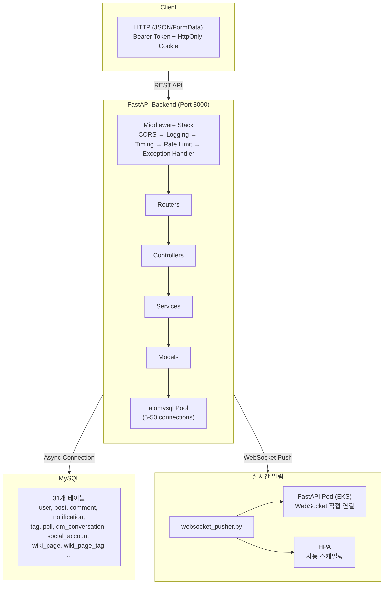
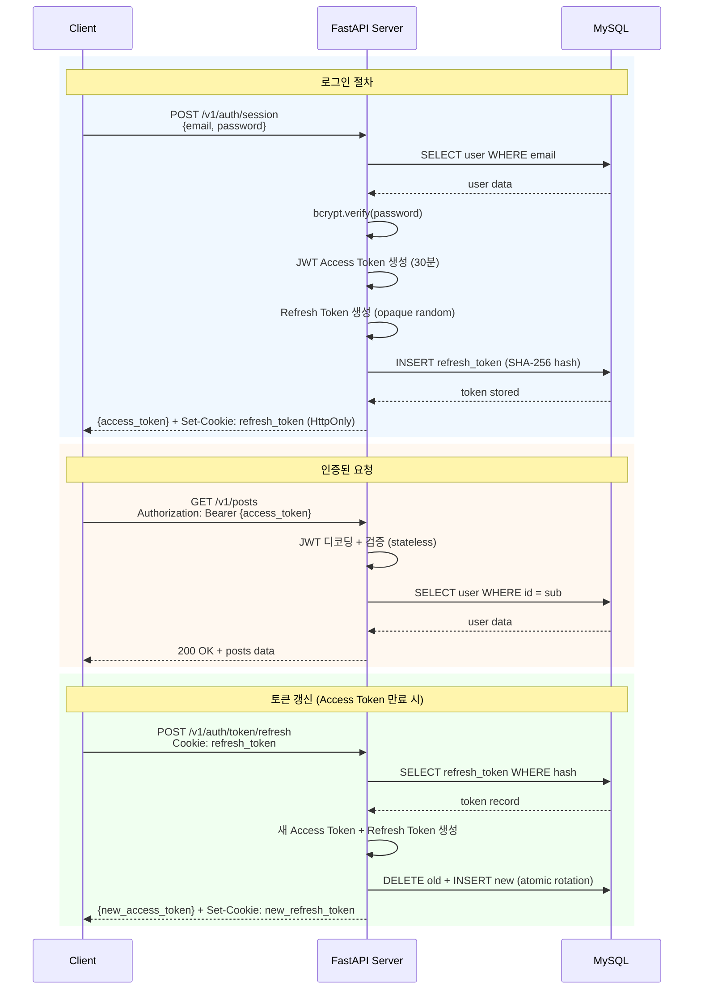
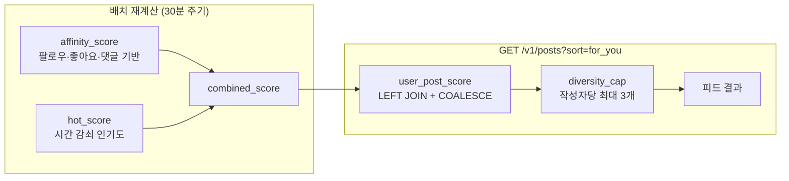
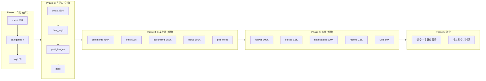

# Camp Linux — Backend

> 리눅스 커뮤니티 "Camp Linux"의 백엔드 서버. **FastAPI** + **MySQL** + **aiomysql** 기반 비동기 REST API.

**Tech Stack**: Python 3.13 · FastAPI · MySQL 8.0+ · aiomysql · JWT · Pydantic · Locust

### 주요 기능

- **게시글 CRUD** — 카테고리, 태그(최대 5개), 다중 이미지(최대 5개, 업로드 시 자동 리사이징), 마크다운, 투표(Poll, 변경/취소), 인기순(Hot) 정렬, FULLTEXT 검색(ngram)
- **댓글 시스템** — 1단계 대댓글, 댓글 좋아요, 정렬(오래된순/최신순/인기순), @멘션 알림(수정 시 신규 멘션만 재파싱), 수정됨 표시
- **인증/보안** — JWT 이중 토큰(Access 30분 + Refresh 7일), 소셜 로그인(GitHub OAuth), 이메일 인증, 이용약관 동의 기록, 계정 정지, 정보 열거 방지
- **소셜 기능** — 팔로우/팔로잉, 팔로잉 피드, DM 쪽지, 사용자 차단, 북마크
- **실시간 알림** — WebSocket (K8s 직접 배포), 폴링 폴백, 유형별 on/off 설정
- **임시저장** — 서버 측 게시글 임시저장 (사용자당 1개, UPSERT), 기기 간 동기화
- **관리자** — 신고 관리, 계정 정지, 게시글 고정, 대시보드 통계
- **패키지 리뷰** — 패키지 등록/조회, 1유저 1패키지 1리뷰, 평점(1~5), 평균 평점 집계
- **인프라** — EKS (K8s) 컨테이너 배포, HPA 자동 스케일링, Locust 부하 테스트

---

## 시스템 아키텍처


```mermaid
flowchart TD
    subgraph Client["Client"]
        FE["HTTP (JSON/FormData)<br/>Bearer Token + HttpOnly Cookie"]
    end

    Client -->|"REST API"| Backend

    subgraph Backend["FastAPI Backend (Port 8000)"]
        direction TB
        MW["Middleware Stack<br/>CORS → Logging → Timing → Rate Limit → Exception Handler"]
        MW --> Routers
        Routers --> Controllers
        Controllers --> Services
        Services --> Models
        Models --> Pool["aiomysql Pool<br/>(5-50 connections)"]
    end

    Backend -->|"Async Connection"| DB

    subgraph DB["MySQL"]
        Tables["31개 테이블<br/>user, post, comment, notification,<br/>tag, poll, dm_conversation, social_account,<br/>wiki_page, wiki_page_tag ..."]
    end

    Backend -->|"WebSocket Push"| WS

    subgraph WS["실시간 알림"]
        Pusher["websocket_pusher.py"]
        Pusher --> K8sPod["FastAPI Pod (EKS)<br/>WebSocket 직접 연결"]
        Pusher --> HPA["HPA<br/>자동 스케일링"]
    end
```

### 백엔드 계층 구조

| 계층 | 디렉토리 | 역할 |
| --- | --- | --- |
| **Router** | `routers/` | API 엔드포인트 정의, 요청 파라미터 파싱 |
| **Controller** | `controllers/` | 비즈니스 로직, HTTP 응답 생성 |
| **Service** | `services/` | 컨트롤러-모델 간 비즈니스 로직 조율 |
| **Model** | `models/` | Raw SQL 쿼리 (aiomysql parameterized queries) |
| **Schema** | `schemas/` | Pydantic 요청/응답 모델, 유효성 검사 |
| **Middleware** | `middleware/` | 로깅, 타이밍, Rate Limiting, 전역 예외 처리 |
| **Dependency** | `dependencies/` | 인증(`get_current_user`, `require_verified_email`, `require_admin`) |
| **Utility** | `utils/` | JWT, 비밀번호 해싱, 이메일 발송, 파일 업로드, WebSocket Pusher |

---

## 데이터베이스 설계

### ERD


```mermaid
erDiagram
    user ||--o{ refresh_token : "has tokens"
    user ||--o{ post : "creates"
    user ||--o{ comment : "writes"
    user ||--o{ post_like : "likes"
    user ||--o{ image : "uploads"
    user ||--o{ post_view_log : "views"
    user ||--o{ email_verification : "verifies"
    user ||--o{ notification : "receives"
    user ||--o{ report : "reports"
    user ||--o{ post_bookmark : "bookmarks"
    user ||--o{ comment_like : "likes comments"
    user ||--o{ user_block : "blocks"
    user ||--o{ user_follow : "follows"
    user ||--o{ dm_conversation : "participates"
    user ||--o{ dm_message : "sends"
    user ||--o{ poll_vote : "votes"
    user ||--o{ user_post_score : "has scores"
    user ||--o{ social_account : "linked"
    user ||--o{ notification_setting : "configures"
    user ||--o{ post_draft : "saves draft"
    post ||--o{ comment : "has"
    comment ||--o{ comment : "replies (1-level)"
    post ||--o{ post_like : "receives"
    post ||--o{ post_bookmark : "bookmarked"
    post ||--o{ post_image : "has images"
    post ||--o{ post_view_log : "tracks"
    post ||--o{ user_post_score : "scored"
    comment ||--o{ comment_like : "receives likes"
    category ||--o{ post : "classifies"
    tag ||--o{ post_tag : "tagged"
    post ||--o{ post_tag : "has tags"
    post ||--o{ poll : "has poll"
    poll ||--o{ poll_option : "has options"
    poll ||--o{ poll_vote : "has votes"
    poll_option ||--o{ poll_vote : "receives"
    dm_conversation ||--o{ dm_message : "contains"
    user ||--o{ package : "registers"
    user ||--o{ package_review : "writes review"
    package ||--o{ package_review : "has reviews"
    user ||--o{ wiki_page : "creates"
    wiki_page ||--o{ wiki_page_tag : "has tags"
    tag ||--o{ wiki_page_tag : "tagged"

    user {
        int id PK
        varchar email UK
        varchar password "bcrypt 해시"
        varchar nickname UK
        varchar profile_img
        enum role "user, admin"
        tinyint email_verified "default 0"
        timestamp suspended_until "NULL = 미정지"
        varchar suspended_reason "정지 사유 (최대 500자)"
        timestamp created_at
        timestamp updated_at
        timestamp deleted_at
    }

    refresh_token {
        int id PK
        int user_id FK
        varchar token_hash UK
        timestamp expires_at
        timestamp created_at
    }

    email_verification {
        int id PK
        int user_id FK "UNIQUE"
        varchar token_hash UK
        timestamp expires_at
        timestamp created_at
    }

    category {
        int id PK
        varchar name UK
        varchar slug UK
        varchar description
        int sort_order
        timestamp created_at
    }

    post {
        int id PK
        int author_id FK
        int category_id FK
        varchar title
        text content
        varchar image_url
        tinyint is_pinned "default 0"
        int views "default 0"
        timestamp created_at
        timestamp updated_at
        timestamp deleted_at
    }

    comment {
        int id PK
        int post_id FK
        int author_id FK
        int parent_id FK "self-ref (1단계 대댓글)"
        text content
        timestamp created_at
        timestamp updated_at
        timestamp deleted_at
    }

    post_like {
        int id PK
        int user_id FK
        int post_id FK
        timestamp created_at
    }

    post_bookmark {
        int id PK
        int user_id FK
        int post_id FK
        timestamp created_at
    }

    comment_like {
        int id PK
        int user_id FK
        int comment_id FK
        timestamp created_at
    }

    post_image {
        int id PK
        int post_id FK
        varchar image_url
        tinyint sort_order
        timestamp created_at
    }

    image {
        int id PK
        varchar image_url
        enum type "profile, post"
        int uploader_id FK
        timestamp uploaded_at
    }

    post_view_log {
        bigint id PK
        int user_id FK
        int post_id FK
        date view_date "GENERATED STORED"
        timestamp created_at
    }

    notification {
        int id PK
        int user_id FK "수신자"
        int actor_id FK "발신자"
        int post_id FK
        int comment_id "NULL 허용"
        enum type "comment, like, mention, follow"
        tinyint is_read "default 0"
        timestamp created_at
    }

    report {
        int id PK
        int reporter_id FK
        enum target_type "post, comment"
        int target_id
        enum reason "spam, abuse, inappropriate, other"
        text description
        enum status "pending, resolved, dismissed"
        int resolved_by FK
        timestamp resolved_at
        timestamp created_at
    }

    user_block {
        int id PK
        int blocker_id FK
        int blocked_id FK
        timestamp created_at
    }

    user_follow {
        int id PK
        int follower_id FK
        int following_id FK
        timestamp created_at
    }

    tag {
        bigint id PK
        varchar name UK "1~30자"
        timestamp created_at
    }

    post_tag {
        int post_id PK
        bigint tag_id PK
    }

    poll {
        int id PK
        int post_id FK "UNIQUE"
        varchar question
        timestamp expires_at
        timestamp created_at
    }

    poll_option {
        int id PK
        int poll_id FK
        varchar option_text
        tinyint sort_order
    }

    poll_vote {
        int id PK
        int poll_id FK
        int option_id FK
        int user_id FK
        timestamp created_at
    }

    dm_conversation {
        int id PK
        int participant1_id FK
        int participant2_id FK
        timestamp last_message_at
        timestamp created_at
        timestamp deleted_at
    }

    dm_message {
        int id PK
        int conversation_id FK
        int sender_id FK
        text content
        tinyint is_read "default 0"
        timestamp created_at
        timestamp deleted_at
    }

    user_post_score {
        int user_id PK
        int post_id PK
        float affinity_score
        float hot_score
        float combined_score
        timestamp computed_at
    }

    social_account {
        int id PK
        int user_id FK
        varchar provider "github, kakao, naver"
        varchar provider_user_id
        timestamp created_at
    }

    notification_setting {
        int id PK
        int user_id FK "UNIQUE"
        tinyint comment_enabled "default 1"
        tinyint like_enabled "default 1"
        tinyint mention_enabled "default 1"
        tinyint follow_enabled "default 1"
        tinyint bookmark_enabled "default 1"
        timestamp created_at
        timestamp updated_at
    }

    post_draft {
        int id PK
        int user_id FK "UNIQUE"
        varchar title
        text content
        int category_id
        timestamp created_at
        timestamp updated_at
    }

    package {
        int id PK
        varchar name UK "패키지 고유 이름"
        varchar display_name
        text description
        varchar homepage_url
        varchar category "editor, devtool, terminal 등"
        varchar package_manager "apt, snap, flatpak 등"
        int created_by FK
        timestamp created_at
        timestamp updated_at
    }

    package_review {
        int id PK
        int package_id FK
        int user_id FK
        tinyint rating "1~5"
        varchar title
        text content
        timestamp created_at
        timestamp updated_at
        timestamp deleted_at
    }

    wiki_page {
        int id PK
        varchar title UK
        varchar slug UK
        text content
        int author_id FK
        int views "default 0"
        timestamp created_at
        timestamp updated_at
        timestamp deleted_at
    }

    wiki_page_tag {
        int wiki_page_id PK
        bigint tag_id PK
    }
```

### 주요 설계 결정

- **Soft Delete**: `user`, `post`, `comment`, `dm_message` 테이블에 `deleted_at` 컬럼 사용. 물리적 삭제 대신 논리적 삭제로 데이터 보존 및 FK 무결성 유지.
- **JWT 기반 인증**: Access Token(30분, HS256) + Refresh Token(7일, opaque random). Refresh Token은 SHA-256 해시로 DB 저장. JWT payload에는 `sub`(user_id)만 포함하여 PII 노출 방지. 토큰 회전(rotation)으로 Refresh Token 탈취 시 자동 무효화.
- **Raw SQL**: ORM 대신 aiomysql parameterized queries를 직접 작성하여 쿼리 최적화 및 성능 제어.
- **인덱스 전략** (30+ 인덱스):
  - `idx_refresh_token_hash`, `idx_refresh_token_user_id`: 인증 토큰 조회
  - `idx_post_list_optimized`: 최신순 게시글 목록 (deleted_at, created_at)
  - `idx_comment_list_optimized`: 게시글별 댓글 목록 (post_id, deleted_at, created_at)
  - `ft_post_search`: FULLTEXT INDEX (ngram parser) — 제목+내용 한국어 검색
  - `idx_notification_user_unread`: 사용자별 읽지 않은 알림 조회
  - `idx_email_verification_token`, `idx_email_verification_expires`: 이메일 인증 토큰 조회
  - `idx_post_category`: 카테고리별 게시글 목록
  - `idx_post_pinned`: 고정 게시글 우선 정렬
  - `idx_report_status`, `idx_report_target`: 신고 상태별/대상별 조회
  - `idx_post_bookmark_post_id`, `idx_post_bookmark_user`: 북마크 조회
  - `idx_comment_like_comment_id`, `idx_comment_like_user`: 댓글 좋아요 조회
  - `idx_user_block_blocker`, `idx_user_block_blocked`: 차단 조회
  - `idx_user_follow_follower`, `idx_user_follow_following`: 팔로우 관계 조회
  - `idx_post_image_post`: 게시글 이미지 정렬 조회
  - `idx_user_suspended`: 정지 상태 사용자 조회
  - `idx_tag_name`, `idx_post_tag_tag_id`: 태그 검색/조회
  - `idx_poll_post`, `idx_poll_option_poll`, `idx_poll_vote_poll`, `idx_poll_vote_user`: 투표 관련
  - `idx_ups_user_combined`: 추천 피드 점수 조회 (user_id, combined_score DESC)
  - `idx_conv_participant1`, `idx_conv_participant2`: DM 대화 참가자 조회
  - `idx_msg_conversation`, `idx_msg_unread`: DM 메시지 목록/안읽음 조회

---

## API 설계

### 인증 API (`/v1/auth`)

| Method | Endpoint | 설명 | 인증 |
| ------ | -------- | ---- | ---- |
| POST | `/v1/auth/session` | 로그인 (Access Token + Refresh Token 발급) | X |
| DELETE | `/v1/auth/session` | 로그아웃 (Refresh Token 무효화) | O |
| POST | `/v1/auth/token/refresh` | 토큰 갱신 (Refresh Token → 새 Access Token) | X (쿠키) |
| GET | `/v1/auth/me` | 현재 사용자 정보 | O |
| POST | `/v1/auth/verify-email` | 이메일 인증 토큰 검증 | X |
| POST | `/v1/auth/resend-verification` | 인증 메일 재발송 | O |

### 소셜 로그인 API (`/v1/auth/social`)

| Method | Endpoint | 설명 | 인증 |
| ------ | -------- | ---- | ---- |
| GET | `/v1/auth/social/{provider}/authorize` | OAuth 인가 URL 반환 (GitHub) | X |
| GET | `/v1/auth/social/{provider}/callback` | OAuth 콜백 처리 → 로그인 또는 가입 리다이렉트 | X |
| POST | `/v1/auth/social/complete-signup` | 소셜 가입 완료 (닉네임 설정) | X (쿠키) |

### 사용자 API (`/v1/users`)

| Method | Endpoint | 설명 | 인증 |
| ------ | -------- | ---- | ---- |
| POST | `/v1/users` | 회원가입 | X |
| POST | `/v1/users/find-email` | 이메일 찾기 (닉네임 → 마스킹 이메일) | X |
| POST | `/v1/users/reset-password` | 비밀번호 재설정 (이메일 → 임시 비밀번호 발송) | X |
| GET | `/v1/users/{user_id}` | 사용자 프로필 조회 | X |
| PATCH | `/v1/users/me` | 프로필 수정 (본인) | O |
| DELETE | `/v1/users/me` | 회원 탈퇴 (본인) | O |
| PUT | `/v1/users/me/password` | 비밀번호 변경 | O |
| POST | `/v1/users/profile/image` | 프로필 이미지 업로드 | O |
| GET | `/v1/users/me/posts` | 내가 쓴 글 목록 | O |
| GET | `/v1/users/me/comments` | 내가 쓴 댓글 목록 | O |
| GET | `/v1/users/me/likes` | 좋아요한 글 목록 | O |
| GET | `/v1/users/me/bookmarks` | 북마크한 글 목록 | O |
| GET | `/v1/users/me/blocks` | 차단한 사용자 목록 | O |
| POST | `/v1/users/{user_id}/block` | 사용자 차단 | O (이메일 인증) |
| DELETE | `/v1/users/{user_id}/block` | 사용자 차단 해제 | O (이메일 인증) |

### 게시글 API (`/v1/posts`)

| Method | Endpoint | 설명 | 인증 |
| ------ | -------- | ---- | ---- |
| GET | `/v1/posts` | 게시글 목록 (페이지네이션, `?search=`, `?sort=latest\|likes\|views\|comments\|hot\|for_you`, `?category_id=`, `?tag=태그명`, `?following=true`) | X |
| POST | `/v1/posts` | 게시글 작성 (`category_id` 필수, `tags[]` 선택, 최대 5개) | O (이메일 인증) |
| GET | `/v1/posts/{post_id}` | 게시글 상세 조회 | X |
| PATCH | `/v1/posts/{post_id}` | 게시글 수정 | O (작성자) |
| DELETE | `/v1/posts/{post_id}` | 게시글 삭제 | O (작성자/관리자) |
| PATCH | `/v1/posts/{post_id}/pin` | 게시글 고정 | O (관리자) |
| DELETE | `/v1/posts/{post_id}/pin` | 게시글 고정 해제 | O (관리자) |
| POST | `/v1/posts/{post_id}/likes` | 좋아요 | O |
| DELETE | `/v1/posts/{post_id}/likes` | 좋아요 취소 | O |
| POST | `/v1/posts/{post_id}/bookmark` | 북마크 추가 | O (이메일 인증) |
| DELETE | `/v1/posts/{post_id}/bookmark` | 북마크 해제 | O (이메일 인증) |
| POST | `/v1/posts/{post_id}/comments/{comment_id}/like` | 댓글 좋아요 | O (이메일 인증) |
| DELETE | `/v1/posts/{post_id}/comments/{comment_id}/like` | 댓글 좋아요 취소 | O (이메일 인증) |
| POST | `/v1/posts/{post_id}/comments` | 댓글 작성 (대댓글: `parent_id` 지원) | O |
| PUT | `/v1/posts/{post_id}/comments/{comment_id}` | 댓글 수정 | O (작성자) |
| DELETE | `/v1/posts/{post_id}/comments/{comment_id}` | 댓글 삭제 | O (작성자/관리자) |
| GET | `/v1/posts/{post_id}/related` | 연관 게시글 추천 (`?limit=5`) | X |
| POST | `/v1/posts/image` | 게시글 이미지 업로드 | O |

### 알림 API (`/v1/notifications`)

| Method | Endpoint | 설명 | 인증 |
| ------ | -------- | ---- | ---- |
| GET | `/v1/notifications` | 알림 목록 조회 (페이지네이션) | O |
| GET | `/v1/notifications/unread-count` | 읽지 않은 알림 수 | O |
| PATCH | `/v1/notifications/{id}/read` | 개별 알림 읽음 처리 | O |
| PATCH | `/v1/notifications/read-all` | 전체 알림 읽음 처리 | O |
| DELETE | `/v1/notifications/{id}` | 알림 삭제 | O |
| GET | `/v1/notifications/settings` | 알림 유형별 설정 조회 | O |
| PATCH | `/v1/notifications/settings` | 알림 유형별 설정 변경 | O |

### 임시저장 API (`/v1/drafts`)

| Method | Endpoint | 설명 | 인증 |
| ------ | -------- | ---- | ---- |
| GET | `/v1/drafts/` | 임시저장 조회 | O |
| PUT | `/v1/drafts/` | 임시저장 생성/갱신 (UPSERT) | O |
| DELETE | `/v1/drafts/` | 임시저장 삭제 | O |

### 태그 API (`/v1/tags`)

| Method | Endpoint | 설명 | 인증 |
| ------ | -------- | ---- | ---- |
| GET | `/v1/tags` | 태그 검색 (`?search=키워드`, 상위 10개, post_count 포함) | X |

### 카테고리 API (`/v1/categories`)

| Method | Endpoint | 설명 | 인증 |
| ------ | -------- | ---- | ---- |
| GET | `/v1/categories` | 카테고리 목록 조회 | X |

### 신고 API (`/v1/reports`, `/v1/admin/reports`)

| Method | Endpoint | 설명 | 인증 |
| ------ | -------- | ---- | ---- |
| POST | `/v1/reports` | 신고 생성 | O (이메일 인증) |
| GET | `/v1/admin/reports` | 신고 목록 조회 (`?status=pending\|resolved\|dismissed`) | O (관리자) |
| PATCH | `/v1/admin/reports/{report_id}` | 신고 처리 (resolved/dismissed, `suspend_days` 옵션) | O (관리자) |

### 계정 정지 API (`/v1/admin/users`)

| Method | Endpoint | 설명 | 인증 |
| ------ | -------- | ---- | ---- |
| POST | `/v1/admin/users/{user_id}/suspend` | 사용자 기간 정지 (1~365일, 사유 필수) | O (관리자) |
| DELETE | `/v1/admin/users/{user_id}/suspend` | 사용자 정지 해제 | O (관리자) |

### 팔로우 API (`/v1/users`)

| Method | Endpoint | 설명 | 인증 |
| ------ | -------- | ---- | ---- |
| POST | `/v1/users/{user_id}/follow` | 팔로우 | O (이메일 인증) |
| DELETE | `/v1/users/{user_id}/follow` | 언팔로우 | O (이메일 인증) |
| GET | `/v1/users/me/followers` | 내 팔로워 목록 | O |
| GET | `/v1/users/me/following` | 내 팔로잉 목록 | O |
| GET | `/v1/users/{user_id}/followers` | 특정 사용자 팔로워 목록 (공개) | X |
| GET | `/v1/users/{user_id}/following` | 특정 사용자 팔로잉 목록 (공개, 페이지네이션) | X |

### DM API (`/v1/dms`)

| Method | Endpoint | 설명 | 인증 |
| ------ | -------- | ---- | ---- |
| GET | `/v1/dms` | DM 대화 목록 | O |
| POST | `/v1/dms` | 대화 시작 (recipient_id) | O |
| GET | `/v1/dms/unread-count` | 읽지 않은 대화 수 | O |
| GET | `/v1/dms/{conversation_id}` | 메시지 목록 | O |
| DELETE | `/v1/dms/{conversation_id}` | 대화 삭제 (soft delete) | O |
| POST | `/v1/dms/{conversation_id}/messages` | 메시지 전송 | O |
| DELETE | `/v1/dms/{conversation_id}/messages/{message_id}` | 메시지 삭제 (soft delete) | O (작성자) |
| PATCH | `/v1/dms/{conversation_id}/read` | 읽음 처리 | O |

### 투표 API

| Method | Endpoint | 설명 | 인증 |
| ------ | -------- | ---- | ---- |
| POST | `/v1/posts/{post_id}/poll/vote` | 투표 참여 (option_id) | O (이메일 인증) |
| PUT | `/v1/posts/{post_id}/poll/vote` | 투표 변경 (다른 option_id) | O (이메일 인증) |
| DELETE | `/v1/posts/{post_id}/poll/vote` | 투표 취소 | O (이메일 인증) |

### 패키지 API (`/v1/packages`)

| Method | Endpoint | 설명 | 인증 |
| ------ | -------- | ---- | ---- |
| GET | `/v1/packages` | 패키지 목록 (페이지네이션, `?search=`, `?category=`, `?sort=latest\|rating\|reviews\|name`) | X |
| POST | `/v1/packages` | 패키지 등록 | O (이메일 인증) |
| GET | `/v1/packages/{package_id}` | 패키지 상세 조회 (평균 평점, 리뷰 수 포함) | X |
| GET | `/v1/packages/{package_id}/reviews` | 패키지 리뷰 목록 (페이지네이션) | X |
| POST | `/v1/packages/{package_id}/reviews` | 리뷰 작성 (1유저 1패키지 1리뷰) | O (이메일 인증) |
| PUT | `/v1/packages/{package_id}/reviews/{review_id}` | 리뷰 수정 | O (작성자) |
| DELETE | `/v1/packages/{package_id}/reviews/{review_id}` | 리뷰 삭제 | O (작성자/관리자) |

### 위키 API (`/v1/wiki`)

| Method | Endpoint | 설명 | 인증 |
| ------ | -------- | ---- | ---- |
| GET | `/v1/wiki/tags/popular` | 위키 인기 태그 상위 N개 조회 | X |

### 관리자 대시보드 API

| Method | Endpoint | 설명 | 인증 |
| ------ | -------- | ---- | ---- |
| GET | `/v1/admin/dashboard` | 대시보드 요약 통계 | O (관리자) |
| GET | `/v1/admin/users` | 사용자 관리 목록 (`?search=&offset=&limit=`) | O (관리자) |

### 내부 API (EventBridge)

| Method | Endpoint | 설명 | 인증 |
| ------ | -------- | ---- | ---- |
| POST | `/v1/admin/feed/recompute` | 추천 피드 점수 재계산 (30분 주기) | O (관리자 또는 내부 키) |
| POST | `/v1/admin/cleanup/tokens` | 만료 Refresh Token + 이메일 인증 토큰 일괄 삭제 (1시간 주기) | O (내부 키) |

### WebSocket (`wss://`)

| 이벤트 | 설명 |
| --- | --- |
| `$connect` | JWT 인증 핸드셰이크, DynamoDB 연결 저장 |
| `$default` | Heartbeat (30초 주기 ping/pong), `typing_start`/`typing_stop` 이벤트 중계 |
| `$disconnect` | DynamoDB 연결 삭제 |
| `notification` | 실시간 알림 푸시 (like, comment, mention, follow) |
| `dm` | 실시간 DM 메시지 수신 |
| `message_deleted` | DM 메시지 삭제 알림 (conversation_id, message_id) |
| `message_read` | DM 읽음 처리 알림 (conversation_id, read_count) |
| `typing` | 타이핑 인디케이터 (conversation_id, sender_id, type: start/stop) |

### 응답 형식

```json
{
  "code": 200,
  "message": "성공",
  "data": { },
  "errors": null,
  "timestamp": "2026-01-01T00:00:00Z"
}
```

### 에러 코드

| HTTP Status | 설명 |
| ----------- | ---- |
| 400 | 잘못된 요청 (유효성 검사 실패) |
| 401 | 인증 필요 (토큰 만료/미로그인) |
| 403 | 권한 없음 (타인의 게시글 수정 시도, 계정 정지 등) |
| 404 | 리소스 없음 |
| 409 | 충돌 (이메일/닉네임 중복, 중복 좋아요/북마크/신고) |
| 429 | 요청 빈도 초과 (Rate Limit) |
| 500 | 서버 오류 |

---

## 인증 흐름


```mermaid
sequenceDiagram
    participant Client
    participant Server as FastAPI Server
    participant MySQL

    rect rgb(240, 248, 255)
        Note over Client,MySQL: 로그인 절차
        Client->>Server: POST /v1/auth/session<br/>{email, password}
        Server->>MySQL: SELECT user WHERE email
        MySQL-->>Server: user data
        Server->>Server: bcrypt.verify(password)
        Server->>Server: JWT Access Token 생성 (30분)
        Server->>Server: Refresh Token 생성 (opaque random)
        Server->>MySQL: INSERT refresh_token (SHA-256 hash)
        MySQL-->>Server: token stored
        Server-->>Client: {access_token} + Set-Cookie: refresh_token (HttpOnly)
    end

    rect rgb(255, 248, 240)
        Note over Client,MySQL: 인증된 요청
        Client->>Server: GET /v1/posts<br/>Authorization: Bearer {access_token}
        Server->>Server: JWT 디코딩 + 검증 (stateless)
        Server->>MySQL: SELECT user WHERE id = sub
        MySQL-->>Server: user data
        Server-->>Client: 200 OK + posts data
    end

    rect rgb(240, 255, 240)
        Note over Client,MySQL: 토큰 갱신 (Access Token 만료 시)
        Client->>Server: POST /v1/auth/token/refresh<br/>Cookie: refresh_token
        Server->>MySQL: SELECT refresh_token WHERE hash
        MySQL-->>Server: token record
        Server->>Server: 새 Access Token + Refresh Token 생성
        Server->>MySQL: DELETE old + INSERT new (atomic rotation)
        Server-->>Client: {new_access_token} + Set-Cookie: new_refresh_token
    end
```

---

## 핵심 패턴

### 트랜잭션 관리 (`transactional()`)

모든 쓰기 작업(INSERT/UPDATE/DELETE)은 `async with transactional() as cur:` 컨텍스트 매니저를 사용. 다중 쿼리의 원자성을 보장하고 Phantom Read를 방지합니다.

```python
async with transactional() as cur:
    await cur.execute("INSERT INTO post ...", params)
    post_id = cur.lastrowid
    await cur.execute("INSERT INTO post_image ...", (post_id, url))
```

- **IntegrityError는 transactional() 밖에서 처리**: 내부에서 catch 후 return하면 context manager가 commit을 시도하여 2차 에러 발생. 반드시 전파시켜 rollback 후 controller에서 처리.
- **격리 수준**: READ COMMITTED (Dirty Read 방지, 성능 균형)

### Soft Delete 패턴

`user`, `post`, `comment`, `dm_message` 테이블에 `deleted_at` 컬럼 사용. 모든 조회 쿼리에 `WHERE deleted_at IS NULL` 조건 필수. 대댓글이 있는 삭제된 부모 댓글은 플레이스홀더로 표시.

### Rate Limiting

IP 기반 요청 빈도 제한. 프로토콜 기반 아키텍처로 메모리(로컬)와 Redis(K8s 프로덕션) 백엔드를 지원합니다.

- **백엔드 선택**: `RATE_LIMIT_BACKEND` 설정 — `memory`(로컬, 기본) 또는 `redis`(K8s 프로덕션)
- 경로 정규화: `_PATH_PARAM_RE`로 `/v1/posts/123` → `/v1/posts/{id}` 변환
- 키 형식: `"IP:METHOD:/v1/path/{id}/action"` — IP + HTTP 메서드 + 경로 독립
- 메모리 보호 (로컬): 최대 10,000개 IP 추적, 초과 시 배치 제거(10%)
- OPTIONS(CORS preflight) 요청 제외

### 정보 열거 방지

이메일 찾기/비밀번호 재설정 API에서 사용자 존재 여부와 무관하게 동일한 응답을 반환. 미존재 사용자도 bcrypt 해싱을 수행하여 타이밍 사이드 채널 공격 방지.

### 이메일 발송

`utils/email.py`에서 `EMAIL_BACKEND` 설정에 따라 SES(프로덕션) 또는 SMTP(로컬) 사용. `asyncio.to_thread()`로 블로킹 SMTP I/O를 비동기 처리.

### @멘션 알림

`utils/mention.py`의 `extract_mentions()`가 게시글/댓글 본문에서 `@닉네임` 패턴(`[a-zA-Z0-9_]{3,10}`)을 파싱. 정규식은 `schemas/user_schemas.py`의 `_NICKNAME_PATTERN`과 동일 문자셋. 수정 시에는 기존 멘션과의 차집합으로 **새로 추가된 멘션에 대해서만** 알림 발송.

### 이미지 리사이징

`utils/image_resize.py`에서 Pillow를 이용해 업로드 시 자동 리사이징. 프로필 최대 400x400, 게시글 최대 폭 1200px (비율 유지). GIF는 애니메이션 보존을 위해 리사이징 제외. local/S3 양쪽 스토리지에 동일 적용.

### 이용약관 동의

회원가입 시 `terms_agreed` 필드 필수. `user.terms_agreed_at` 컬럼에 동의 시각(`NOW()`)을 기록. 미동의 시 400 반환.

### WebSocket 실시간 푸시

`utils/websocket_pusher.py`가 알림 생성 시 DynamoDB에서 대상 사용자의 WebSocket 연결을 조회하고 API Gateway ManagementAPI로 메시지를 전송. Best-effort 방식으로 트랜잭션 밖에서 처리되며, 실패해도 알림 생성에 영향 없음.

### datetime 포맷팅

모든 모델의 datetime 필드는 `utils/formatters.py`의 `format_datetime()`으로 ISO 8601 변환 후 반환. 모델 레벨에서 일관 적용.

### 인기 게시글 (Hot Score)

```
score = (likes * 3 + comments * 2 + views * 0.5) / POW(hours_since_creation + 2, 1.5)
```

시간 감쇠 가중치 수식으로 최근 인기 게시글이 상위에 노출됩니다.

### 추천 피드 (For You Feed)

`user_post_score` 테이블에 사전 계산된 점수를 저장하고 30분 주기로 배치 재계산합니다.


```mermaid
flowchart LR
    subgraph 배치["배치 재계산 (30분 주기)"]
        A["affinity_score<br/>팔로우·좋아요·댓글 기반"] --> C["combined_score"]
        H["hot_score<br/>시간 감쇠 인기도"] --> C
    end
    subgraph 조회["GET /v1/posts?sort=for_you"]
        C --> UPS["user_post_score<br/>LEFT JOIN + COALESCE"]
        UPS --> CAP["diversity_cap<br/>작성자당 최대 3개"]
        CAP --> FEED["피드 결과"]
    end
```

- `user_has_scores()` False이면 `latest` 폴백
- `_apply_diversity_cap()`: 동일 작성자 게시글 최대 3개까지만 노출

### 연관 게시글 추천

`LEFT JOIN post_tag`으로 현재 게시글과 태그 매칭 수를 계산하고, 동일 카테고리 보너스 + hot score를 가산하여 정렬. 태그 없는 게시글은 카테고리 + hot score로 폴백. 차단 사용자의 게시글 제외.

---

## 보안

| 항목 | 구현 방식 |
| ---- | --------- |
| **비밀번호 해싱** | bcrypt (cost factor 기본값), `asyncio.to_thread()`로 비동기 처리 |
| **JWT 인증** | Access Token(30분, in-memory) + Refresh Token(7일, HttpOnly Cookie, SHA-256 해시 DB 저장, 토큰 회전) |
| **Refresh Token 보안** | `SELECT ... FOR UPDATE` 행 잠금으로 동시 재사용(replay attack) 방지 |
| **CORS** | 허용 출처 명시적 설정, `allow_credentials=true` 시 와일드카드 금지 |
| **SQL Injection** | Parameterized queries (aiomysql), 정렬 옵션 화이트리스트 검증 |
| **타이밍 공격** | 미존재 사용자 로그인 시에도 실제 bcrypt 검증 수행 |
| **정보 열거 방지** | 이메일/비밀번호 찾기에서 존재 여부 무관하게 동일 응답 반환 |
| **Path Traversal** | `Path.resolve()` + `is_relative_to()`로 경로 탈출 차단 |
| **이미지 URL 검증** | `schemas/_image_validators.py` 공통 헬퍼로 업로드/프로필 이미지 URL 검증 |
| **Rate Limiting** | IP 기반 엔드포인트별 요청 빈도 제한, 메모리 상한 보장 |
| **계정 정지** | `_validate_token()` + `login()` + `refresh_token()` 3중 차단, 기간 자동 만료 |
| **시크릿 관리** | AWS Secrets Manager + External Secrets Operator (ESO)로 K8s Secret 자동 동기화 |
| **DEBUG 모드** | 기본값 `False`, 프로덕션 에러 메시지에 내부 정보 미포함 |

---

## 시작하기

### 사전 요구사항

- Python 3.13
- MySQL 8.0+
- uv (패키지 매니저)

### 설치 및 실행

```bash
# 1. MySQL 설치 및 실행 (macOS)
brew install mysql
brew services start mysql

# 2. 데이터베이스 생성
mysql -u root -p -e "CREATE DATABASE community_service;"

# 3. 백엔드 설정
cd 2-cho-community-be
python -m venv .venv
source .venv/bin/activate
uv pip install -e ".[dev]"

# 4. 환경변수 설정
cp .env.example .env
# .env 파일에서 DB_USER, DB_PASSWORD, SECRET_KEY 수정

# 5. 스키마 적용 및 시드 데이터
mysql -u root -p community_service < database/schema.sql
python database/seed_data.py  # 선택사항

# 6. 서버 실행
uvicorn main:app --reload --port 8000
```

서버가 `http://localhost:8000`에서 실행됩니다. API 문서는 `http://localhost:8000/docs`에서 확인할 수 있습니다.

---

## 설정

### 환경변수 (`.env`)

| 변수 | 설명 | 기본값 |
| ---- | ---- | ------ |
| `DB_HOST` | MySQL 호스트 | `127.0.0.1` |
| `DB_PORT` | MySQL 포트 | `3306` |
| `DB_USER` | MySQL 사용자 | (필수) |
| `DB_PASSWORD` | MySQL 비밀번호 | (필수) |
| `DB_NAME` | 데이터베이스명 | `community_service` |
| `SECRET_KEY` | JWT 서명키 (HS256) | (필수) |
| `DEBUG` | 디버그 모드 | `False` |
| `ALLOWED_ORIGINS` | CORS 허용 출처 | `http://localhost:8080` |
| `EMAIL_BACKEND` | 이메일 발송 방식 | `smtp` |
| `EMAIL_FROM` | 발신 이메일 주소 | - |
| `SMTP_HOST` | SMTP 서버 호스트 | - |
| `SMTP_PORT` | SMTP 서버 포트 | - |
| `TESTING` | Rate Limit 비활성화 | `false` |
| `TRUSTED_PROXIES` | 프록시 신뢰 IP | `127.0.0.1,::1` |
| `RATE_LIMIT_BACKEND` | Rate Limiter 백엔드 (`memory` / `redis`) | `memory` |
| `INTERNAL_API_KEY` | EventBridge 내부 API 키 | (SSM) |

---

## 테스트

```bash
# 가상환경 활성화
cd 2-cho-community-be && source .venv/bin/activate

# 전체 테스트
pytest

# 단일 테스트
pytest tests/engagement/test_poll.py::test_cancel_vote_returns_200

# 커버리지 리포트
pytest --cov

# 린팅
ruff check .
ruff check . --fix

# 타입 체크
mypy .
```

**테스트 현황**: 242개 테스트, 82% 커버리지 (bcrypt rounds 최적화로 ~30초 실행)

### 대규모 시드 데이터 (`seed_data_large.py`)

RDS에 영구 보존할 대규모 시드 데이터를 생성합니다. 추천 피드 테스트와 부하 테스트에 활용.

```bash
# SSH 터널 열기
ssh -i ~/.ssh/키파일 -L 3307:<RDS_ENDPOINT>:3306 ec2-user@<BASTION_IP> -N

# 설정 확인 (DB 접속 없이)
python database/seed_data_large.py --db-user admin --db-password SECRET --dry-run

# 시딩 실행
python database/seed_data_large.py \
    --db-host 127.0.0.1 --db-port 3307 \
    --db-user admin --db-password SECRET --no-confirm

# 기존 데이터 삭제 후 재시딩
python database/seed_data_large.py \
    --db-host 127.0.0.1 --db-port 3307 \
    --db-user admin --db-password SECRET --no-confirm --clean

# 추천 점수 재계산 포함
python database/seed_data_large.py \
    --db-host 127.0.0.1 --db-port 3307 \
    --db-user admin --db-password SECRET --no-confirm \
    --recompute-url https://api.my-community.shop
```

| 항목 | 규모 |
| --- | --- |
| 사용자 | 50,000명 (Power 5% / Regular 25% / Reader 70%) |
| 게시글 | ~250,000개 (성장 곡선 시간 분포) |
| 댓글 | ~750,000개 (80% 루트 + 20% 대댓글) |
| 좋아요/북마크/조회 | ~950,000건 (인기 편중 분포) |
| 팔로우/차단/알림/신고/DM | ~680,000건 |
| **총 행 수** | **~300만** |

**실행 흐름 (5-Phase)**


```mermaid
flowchart LR
    subgraph P1["Phase 1: 기반 (순차)"]
        U[users 50K] --> C[categories 4] --> T[tags 50]
    end
    subgraph P2["Phase 2: 콘텐츠 (순차)"]
        PO[posts 250K] --> PT[post_tags] --> PI[post_images] --> PL[polls]
    end
    subgraph P3["Phase 3: 상호작용 (병렬)"]
        direction TB
        CM[comments 750K]
        LK[likes 500K]
        BK[bookmarks 150K]
        VW[views 500K]
        PV[poll_votes]
    end
    subgraph P4["Phase 4: 소셜 (병렬)"]
        direction TB
        FL[follows 100K]
        BL[blocks 2.5K]
        NF[notifications 500K]
        RP[reports 2.5K]
        DM[DMs 80K]
    end
    subgraph P5["Phase 5: 검증"]
        VR[행 수 + 무결성 검증]
        RC[피드 점수 재계산]
    end
    P1 --> P2 --> P3 --> P4 --> P5
```

- **배치 INSERT**: 5,000행씩 `INSERT IGNORE` (UNIQUE 테이블) / `INSERT` (일반 테이블)
- **asyncio.gather**: Phase 3, 4에서 독립 테이블 병렬 처리
- **소요 시간**: SSH 터널 경유 ~5-10분

### 부하 테스트 (Locust)

```bash
# Locust 설치
uv pip install -e ".[load-test]"

# 테스트 계정 시딩 (15~25분 소요)
python -m load_tests.seed_accounts --mode api --host https://api.my-community.shop

# UI 모드 (localhost:8089)
locust -f load_tests/locustfile.py --host=https://api.my-community.shop

# CLI 모드
locust -f load_tests/locustfile.py --host=https://api.my-community.shop \
    --users=100 --spawn-rate=5 --run-time=10m --headless

# 로컬 테스트
locust -f load_tests/locustfile.py --host=http://127.0.0.1:8000
```

3종 사용자 시나리오: ReaderUser(60%), WriterUser(20%), ActiveUser(20%). 계정 풀(`queue.Queue`)로 동시 사용자 간 1:1 바인딩.

**EKS Prod 부하 테스트 결과**

| 항목 | 결과 |
| --- | --- |
| **대상** | EKS Prod (`api.my-community.shop`) |
| **동시 사용자** | 100명 |
| **에러율** | 읽기/쓰기 API 0% |
| **P95 응답시간** | 100ms |
| **처리량** | 25.3 RPS |

---

## 비밀번호 정책

- 길이: 8-20자
- 필수 포함: 대문자, 소문자, 숫자, 특수문자
