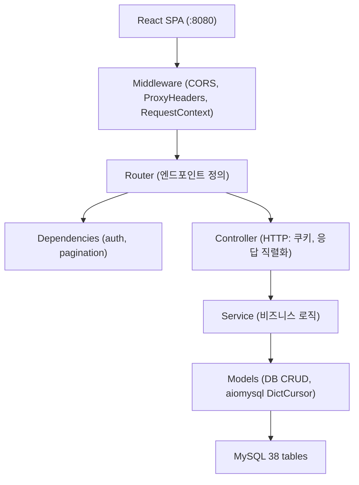

# Backend 아키텍처

FastAPI + MySQL + aiomysql 비동기 REST API. 모듈러 모놀리스.

## 레이어 구조



## 디렉토리 구조

```
main.py                        진입점 — 라우터 등록, 미들웨어, 프로브 엔드포인트
core/                          공유 인프라
  config.py                    환경 설정 (SSM + .env fallback)
  database/                    DB 풀 관리, schema.sql, Dockerfile
  dependencies/                auth (JWT 추출), pagination, request_context
  middleware/                  CORS, proxy headers, rate limit
  utils/                       jwt, password, email, error_codes, exceptions
modules/                       10개 도메인 모듈
  <domain>/
    router.py                  FastAPI 라우터 + Depends 주입
    controller.py              HTTP 관심사 (쿠키, Request/Response)
    service.py                 비즈니스 로직 (인증, 권한, 유효성)
    models.py                  DB CRUD (aiomysql DictCursor)
    schemas.py                 Pydantic 모델 (선택)
schemas/
  common.py                    create_response, serialize_user
migrations/                    Alembic 마이그레이션
tests/
  unit/                        단위 테스트
  integration/                 통합 테스트 (Redis 필요)
  smoke/                       스모크 테스트 (배포 환경 대상)
```

## 10개 도메인 모듈

| 모듈 | 테이블 수 | 핵심 기능 |
|------|-----------|-----------|
| `auth` | 3 | JWT 발급/갱신, OAuth (GitHub), 이메일 인증, 토큰 회전 |
| `user` | 7 | 프로필 CRUD, 팔로우/차단, 활동 조회, 이미지 업로드 |
| `post` | 8 | 게시글 CRUD, 댓글, 좋아요, 북마크, 투표, 구독, 피드 |
| `dm` | 2 | 1:1 대화, 메시지 발송, 읽음 처리, soft delete |
| `notification` | 2 | 알림 CRUD, 유형별 설정, 벌크 생성 |
| `admin` | 0 | 신고 처리, 사용자 정지/해제, 대시보드, 피드 재계산 |
| `content` | 5 | 카테고리, 태그, 임시저장, 이용약관 |
| `wiki` | 3 | 위키 CRUD, 리비전/diff/롤백, 태그 |
| `package` | 2 | 패키지 등록, 리뷰 (사용자당 1개) |
| `reputation` | 4 | 이벤트 기록, 뱃지 (27개), 신뢰 레벨 (0-4), 일일 방문 |

## 핵심 패턴

### 인증
- Access Token (HS256 JWT, 30분) + Refresh Token (opaque, 7일, HttpOnly cookie)
- 토큰 회전: `SELECT FOR UPDATE` → DELETE + INSERT (원자적)
- 타이밍 공격 방지: 존재하지 않는 사용자도 bcrypt 검증 수행

### DB 접근
- aiomysql 커넥션 풀 (`async with pool.acquire()`)
- DictCursor 사용 — 결과를 딕셔너리로 반환
- 파라미터 바인딩 필수 (SQL injection 방지)

### 응답 형식
```python
create_response("CODE", "메시지", data={...}, timestamp=timestamp)
# → {"code": "CODE", "message": "...", "data": {...}, "errors": [], "timestamp": "..."}
```

### 배치 최적화
- `create_notifications_bulk()` — 팔로워 알림 벌크 INSERT (N+1 방지)
- `get_users_by_nicknames()` — 멘션 닉네임 배치 조회 (N+1 방지)
- `user_post_score` — 추천 피드 점수, 30분 배치 재계산

### Soft Delete
- `user`, `post`, `comment`, `dm_message`
- 조회 시 `WHERE deleted_at IS NULL` 필수
